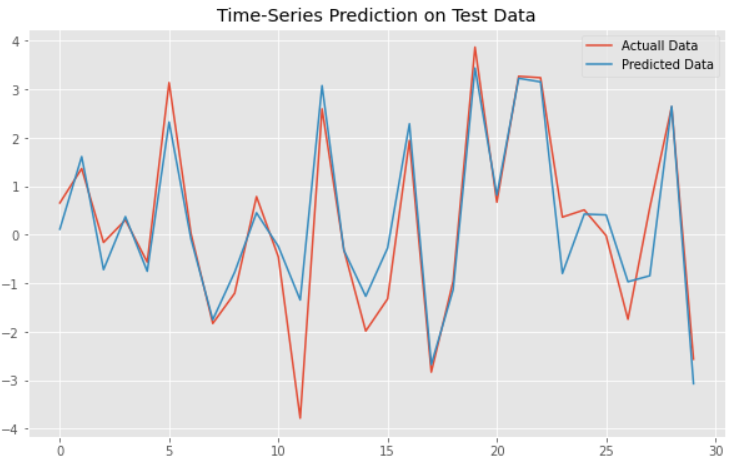
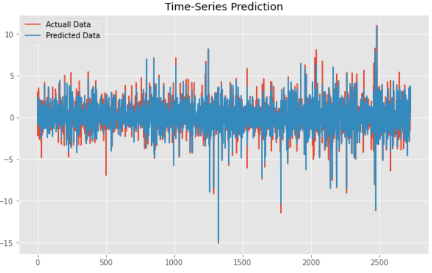
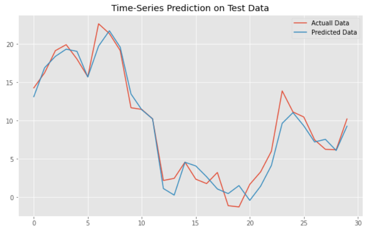
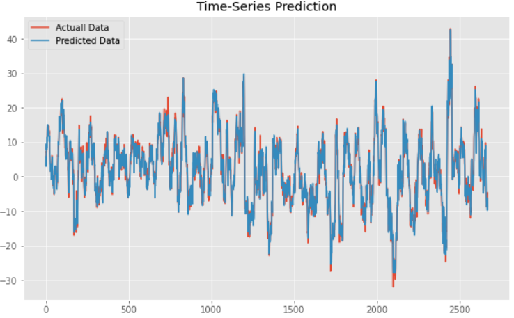

# Predictions are done for 2 types of traders:
- traders seeking per day returns 
- traders holding their positions for over a month

# Results:
## Per day growth:

### For the month of march:

R2_score= 0.8706 (coefficient of determination)

### On entire dataset:

## Growth over 30 days:

### For the month of march:

R2_score= 0.9496 (coefficient of determination)

### On entire dataset:

